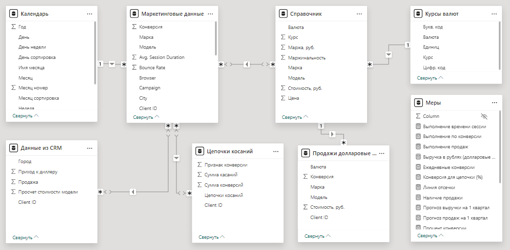

## [Промежуточная аттестация](https://gb.ru/lessons/450164/homework)
### (Excel, Power BI, Python)

### Описание бизнес кейса
Авто дилер Премиум Авто хочет проанализировать эффективность маркетинговых кампаний в интернете. Так как у самой компании не хватает компетенций для такого анализа, то она наняла консалтинговую IT компанию, которая должна помочь ему в этом проекте. В ходе пресейла консультанты договорились с клиентом, что сделают пилотный проект на основании ограниченных данных за 1,5 месяца и по двум маркам: BMW и Mercedes. Если результаты пилотного проекта устроят заказчика, то будет заключен полноценный контракт на внедрение проекта, который будет позволять отслеживать эффективность маркетинга на постоянно основе.

В рамках пилотного проекта, мы решили объединить данные из Google analytics и CRM системы, для того, чтобы посмотреть какие кампании приводят не только к заявкам, но и к продажам. Наши коллеги внедрили Client ID, который пробрасывается из web аналитики в CRM, данные были накоплены за несколько месяцев и параллельно были созданы коннекторы к Google analytics и CRM. Текущая наша задача заключается в том, чтобы забрать данные из систем, объединить их, вывести недостающие данные и на их основе выдать клиенту дашборд, который ответить на его вопросы.

Описание датасета и инструментария:

Данные из 2 систем
2 рабочие таблицы
1 справочник
1 источник внешний из интернета
Проект можно выполнить по-разному, поэтому вы можете сами выбирать инструмент, в котором выполняете задание: Excel, Power BI или Python. Однако вы должны использовать все три инструмента на разных этапах работы.

### 1. Работа с данными (Подготовка данных)

- Ссылка на данные: https://docs.google.com/spreadsheets/d/152JyksagijqyscnrFDc6Ez2VjT5MKNXpDOyc4PRlauw/edit#gid=208646510
- Выделите в Маркетинговых данных признак марки и модели автомобиля
- Загрузите данные по курсам валют на дату с сайта ЦБ РФ
- Объедините все 4 получившиеся таблицы
- Добавьте недостающие показатели в Справочник: Итоговую стоимость в рублях и маржу в рублях
- Добавьте недостающие данные: цепочки касаний, сумма конверсий по цепочкам, признак конверсии по цепочкам, сумма касаний для каждой цепочки и соответственно каждого пользователя.

```Actionscript
Данная часть задания выполнена с использованием MS Power BI.
```

[Файл проекта в Power BI](ПремиумАвто.pbix)

### 2. Аналитика

```Actionscript
Данная часть задания выполнена с использованием Python и MS Power BI (лист Аналитика).
Так же использовался Excel для предварительного анализа данных
```
[Файл расчета Python](MakeAnalitics.py)

[Файл проекта в Power BI](ПремиумАвто.pbix)

Рассчитайте следующие показатели:
- Из каких регионов больше всего заявок?
```Actionscript
Топ-3 регионов с наибольшим количеством заявок:
Region
Krasnodar Krai    8445.0
Stavropol Krai     648.0
Moscow             510.0
```
- Какой средний процент отказов (Bounce)?
```Actionscript
Данная часть задания выполнена с использованием меры в MS Power BI.
Средний процент отказов: 0.23%
```
- С каких устройств чаще заходят на сайты?
```Actionscript
Количество заходов с разных устройств:
Device Category
mobile     15112
desktop     8673
tablet       645
```
- Какие источники наиболее конвертируемые?
```Actionscript
Топ источников по количеству конверсий:
Source
google                2874.0
(direct)              2182.0
BMW0keyauto0krd.ru    1837.0
yandex                1811.0
yandex.ru             1590.0
```
- Рассчитайте ROMI (при расчете придумайте методологию расчета средней стоимость проданного автомобиля)
```Actionscript
Расчет дохода на основе средней стоимости автомобиля= 5333674.179 (получено из PowerBI)
Предположим, что стоимость привлечения одной сессии составляет 100 руб.

Топ-10 источников по ROMI:
                   Sessions  Goal Completions  ...  Marketing Cost         ROMI
Source                                         ...                             
alohafind.com           1.0               1.0  ...           100.0  5333574.179
avtoavto.ru             1.0               1.0  ...           100.0  5333574.179
adguard.com             1.0               1.0  ...           100.0  5333574.179
rambler.ru              1.0               1.0  ...           100.0  5333574.179
tut.by                  1.0               1.0  ...           100.0  5333574.179
krd.rusdealers.ru       1.0               1.0  ...           100.0  5333574.179
baidu.com               1.0               1.0  ...           100.0  5333574.179
im.magnit.ru            1.0               1.0  ...           100.0  5333574.179
rambler                30.0              20.0  ...          3000.0  3555682.786
110km.ru                6.0               4.0  ...           600.0  3555682.786
```
- Посчитайте выручку в рублях только по долларовым позициям
```Actionscript
Данная часть задания выполнена с использованием меры в MS Power BI.
Выручка в рублях только по долларовым позициям: 7.01 млрд руб.
```
- Определите, какой источник трафика наиболее выгоден для компании по текущим данным?
```Actionscript
Данная часть задания выполнена с использованием графика в MS Power BI.
Наиболее выгодный источник трафика `google`
22 432 Sessions
9 106 Конверсий
241 050 838 Goal Value
```
- Ответьте на вопрос: каких показателей не хватает, чтобы посчитать чистую прибыль?
```Actionscript
Для расчета чистой прибыли нам не хватает следующих ключевых показателей: 
 - Себестоимость проданных товаров или услуг
 - Операционные расходы (затраты на маркетинг, зарплаты, аренду и т.д.)
 - Налоги
```
- Сделать прогноз до конца февраля по количеству конверсий на каждый день
```Actionscript
Данная часть задания выполнена с использованием графика в MS Power BI.
"Ежедневные конверсии по Date"
``` 
- Какая будет выручка за первый квартал, если средняя стоимость авто останется неизменной, а продажи будут пропорциональны текущим данным?
```Actionscript
Данная часть задания выполнена с использованием меры в MS Power BI.
334.02 млрд руб. прогноз выручки на 1 квартал
``` 


### 3. Визуализация

```Actionscript
Данная часть задания выполнена с использованием MS Power BI (лист Дашборд).
```

[Файл проекта в Power BI](ПремиумАвто.pbix)

Настройте цветовую тему и оформите дашборд, который содержит следующую информацию:
- Цепочки касаний с дополнительными полезными характеристиками и с раскраской в зависимости от того, была ли продажа у цепочки
- Карту продаж по регионам и городам
- Матрицу с воронкой продаж по каждой модели и марке
- Количество продаж по источникам трафика с линией отсечки в 230
- Декомпозицию продаж по источникам трафика (Source, Medium, Keyword, Campaign)
- Продажи за каждый день с раскраской по выполнению целевых показателей (их выберете сами)
- Фильтр по количеству касаний и признаку конверсии + любые другие полезные фильтры, которые посчитаете нужным (от 5 до 7 фильтров всего)
- Среднее количество касаний в цепочке
