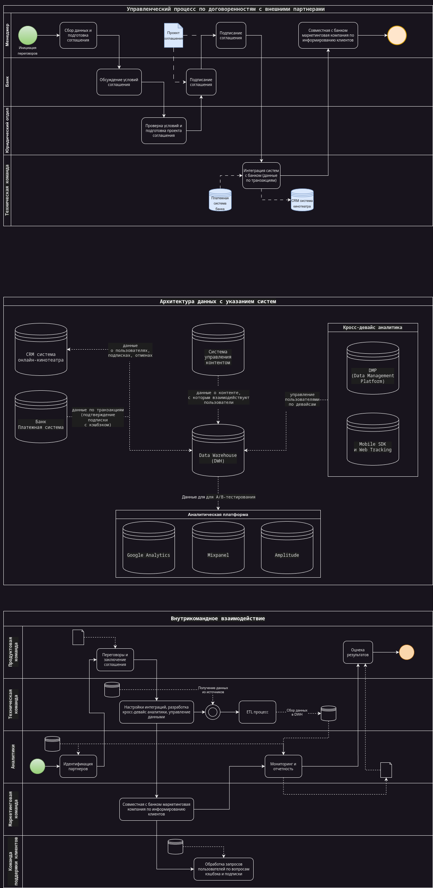

## Task 1

Подведите итоги эксперимента в экселе по следующим данным:
[ab_stats.csv](https://drive.google.com/file/d/1XYk_NrBvrpx9IEA-_0gSndcINuoGudW6/view).

- Стат значимо ли отличается ARPPU в двух группах?
- Какие рекомендации дадите менеджеру?

**Решение:**

Файл содержит данные с колонками:

- `revenue`: выручка, полученная от пользователя.
- `num_purchases`: количество покупок, совершенных пользователем.
- `purchase`: факт покупки (0 или 1).
- `ab_group`: группа A/B-теста (A или B).
- `av_site visit`: среднее время на сайте (вероятно, среднее время посещения).

ARPPU (Average Revenue Per Paying User) для каждой группы рассчитывается как:

$ARPPU = \frac{\text{revenue}}{\text{purchase > 0}}$

```markdown
total_revenue paying_users ARPPU

ab_group
A 4786.807972 256 18.698469
B 2892.735789 234 12.362119
```

Теперь необходимо провести статистический тест (например, t-тест) для проверки значимых различий между группами. Для вычисления T-статистики и P-значения используем **t-тест для двух независимых выборок**:

1. **Формулировка гипотез:**
    - Нулевая гипотеза ($H_0$): Средние значения `ARPPU` в группах `A` и `B` не различаются.
    - Альтернативная гипотеза ($H_1$): Средние значения `ARPPU` в группах `A` и `B` отличаются.

2. **T-тест**:
   Используем тест на разницу средних двух независимых выборок. Основные параметры для t-теста:
    - $\text{T-статистика}$: показатель величины разницы между двумя средними значениями.
    - $\text{P-значение}$: вероятность того, что разница между группами возникла случайно. Если $p < 0.05$, разница считается статистически значимой.

Формула для `t-статистики`:

$T = \frac{\bar{X}_1 - \bar{X}_2}{\sqrt{\frac{s_1^2}{n_1} + \frac{s_2^2}{n_2}}}$

Где:

- $\bar{X}_1$ и $\bar{X}_2$ — средние значения ARPPU для групп A и B.
- $s_1^2$ и $s_2^2$ — дисперсии (variance) в группах A и B.
- $n_1$ и $n_2$ — количество наблюдений в каждой группе.

### P-значение:

После расчета t-статистики используем распределение Стьюдента (t-distribution), чтобы получить p-значение, которое указывает на вероятность того, что различие между группами является случайным.

### Вычисления в нашем случае:

1. **Средние значения** для групп A и B: это были фактические ARPPU.
2. **T-статистика**: 1.13
3. **P-значение**: 0.26

T-статистика 1.13 указывает на небольшую разницу между группами, но p-значение 0.26 (больше 0.05) означает, что эта разница статистически незначима.

Таким образом, можно сказать, что различие ARPPU между группами A и B могло возникнуть случайно, и оно не является доказанным на уровне значимости 5%.

**Рекомендации менеджеру**:
На основе текущих данных и анализа можно сделать вывод, что изменение (тестирование группы B) не привело к значимому изменению выручки на пользователя.
Рекомендуется проанализировать другие метрики или провести более длительное тестирование для получения более точных результатов.

[Excel-файл](ab_test.xlsx)

## Task 2

Мы хотим провести А/Б-тест для трех источников трафика. Нынешняя конверсия равна 5%, мы ожидаем прирост в 0,2%. Уровень доверия 97% и уровень мощности 87%.
Всего на наш продукт заходит 40 000 пользователей в месяц.

За сколько дней мы сможем протестировать гипотезу? И что вы можете посоветовать по результатам подсчета?

**Решение:**

Для расчета количества дней нам нужно:

- Конверсия текущая: $5\%$ (или $0.05$).
- Ожидаемый прирост: $0.2\%$ (или $0.002$).
- Уровень доверия: $97\%$ — это означает, что $\alpha = 1 - 0.97 = 0.03$.
- Мощность теста: $87\%$ — это значит, что $\beta = 1 - 0.87 = 0.13$.
- Количество пользователей в месяц: $40,000$.

Используем статистические методы для расчета необходимого размера выборки для A/B-теста, а затем определим, сколько дней потребуется для достижения этого объема выборки с данным потоком трафика.

Расчет сделан в python [-> file task_2.py](task_2.py)

`effect_size` — рассчитываем эффект на основе разницы между текущей и ожидаемой конверсией с помощью `proportion_effectsize`.

`solve_power` — используем для расчета необходимого размера выборки на основе уже известного `effect_size`.

`total_sample_size` — это общее количество пользователей, необходимое для обеих групп.

`days_needed` — количество дней, необходимых для тестирования, исходя из количества пользователей в день.

Расчет показывает следующие результаты:

```markdown
Необходимое количество пользователей для каждой группы: 262946.43
Общее количество пользователей: 525892.86
Необходимое количество дней для тестирования: 394.42
```

### С учетом расчетов можно сделать следующие выводы и рекомендации:

1. **Длительность теста**:
    - Общее количество пользователей, необходимых для тестирования, составляет около **525,893**.
    - При текущем трафике в **40,000 пользователей в месяц** тест будет длиться примерно **394 дня**, что более чем год.

2. **Малый прирост конверсии**:
    - Ожидаемый прирост конверсии составляет всего **0.2%**. Это очень незначительное изменение, что требует большого объема данных для того, чтобы надежно подтвердить статистическую значимость результатов.

3. **Высокий уровень доверия и мощности**:
    - Мы задали довольно высокие параметры для уровня доверия (97%) и мощности теста (87%). Это обеспечивает точные и надежные результаты, но требует значительно большего объема данных.

### Рекомендации:

1. **Оптимизация дизайна теста**:
    - Рассмотреть возможность **снижения уровня доверия** (например, до 95%) и/или **мощности** теста (например, до 80%). Это уменьшит необходимое количество данных и сократит срок теста.

2. **Увеличение трафика**:
    - Если возможно, увеличить приток пользователей на сайт с других источников, что позволит провести тест быстрее.
      Например, привлечение большего количества пользователей за счет маркетинговых активностей поможет завершить тест за меньшее время.

3. **Целесообразность такого теста**:
    - Поскольку тест будет длиться более года с текущим уровнем трафика, нужно задаться вопросом, насколько важен этот тест для бизнеса.
Стоит рассмотреть альтернативные варианты тестирования с меньшим уровнем точности или поиска более значительного прироста конверсии, чтобы сократить срок тестирования.

4. **Другие показатели**:
    - Помимо конверсии, рассмотреть возможность тестирования других метрик, которые могут дать более быстрые и значимые результаты.
Например, измерение средней выручки на пользователя (ARPU), времени на сайте или других факторов, которые могут быстрее показать результаты.

В целом, такой длительный тест может быть не очень эффективным, поэтому стоит рассмотреть возможности оптимизации параметров или проведения теста на других метриках.

---

## Task 3

Допустим в задаче нет проблемы с количеством посетителей на сайт, тогда подведите результаты тестирования, если у нас следующие результаты по количеству конверсии:

- 1 - 25000
- 2 - 30000
- 3 - 32000

**Решение:**

Для каждого источника нужно рассчитать фактическую конверсию и провести тест для определения статистически значимых различий.

Рассчитанные конверсии для трёх источников ([с использованием python](task_3.py)):

- Источник 1: 62.5% (25 000 конверсий).
- Источник 2: 75% (30 000 конверсий).
- Источник 3: 80% (32 000 конверсий).

Эти конверсии значительно выше текущей базовой конверсии в 5%.
Проверим статистическую значимость различий между этими источниками.
Выполним парные статистические тесты ([с использованием python](task_3.py)) для сравнения конверсий между источниками.

Результаты статистического анализа:

1. **Сравнение источников 1 и 2**:
    - Z-статистика: -38.14
    - P-значение: < 0.0001

2. **Сравнение источников 2 и 3**:
    - Z-статистика: -16.93
    - P-значение: < 0.0001

Оба сравнения показывают, что p-значения меньше 0.0001, что означает, что различия между конверсиями источников статистически значимы.

### Рекомендации:

Результаты показывают значимые различия в конверсиях между всеми источниками.
Это означает, что конверсия каждого следующего источника статистически лучше предыдущего.
На основе этих данных можно сделать вывод, что источники трафика существенно отличаются по эффективности, и стоит рассмотреть перераспределение бюджета в пользу более конверсионных источников.

---

## Task 4

Вы решили сравнивать метрику CPA в двух группах. Размер выборки - 2350 элементов в каждой группе.
Для проверки нормальности распределения на выборке в 2350 наблюдений применили, критерий Шапиро-Уилка и получили p-value, равный 0.00002, alpha = 5%.
Какой бы вывод мы могли сделать в данном случае?
В этом случае какой статистический критерий для проверки первоначальной гипотезы тут лучше всего подойдёт и почему?

**Решение:**

В данном случае, критерий Шапиро-Уилка был применён для проверки нормальности распределения метрики CPA в двух группах.

### Выводы из теста Шапиро-Уилка:

1. **Нулевая гипотеза** теста Шапиро-Уилка гласит, что выборка **имеет нормальное распределение**.
2. $p$-значение $0.00002$ значительно меньше уровня значимости $\alpha = 0.05$, что означает, что мы **отвергаем нулевую гипотезу**.
3. Таким образом, на основании теста можно сделать вывод, что распределение метрики CPA **не является нормальным**.

### Какой статистический критерий выбрать?

Так как данные **не имеют нормального распределения**, использование параметрических тестов, таких как t-тест для сравнения средних, не будет корректным.
Вместо этого лучше использовать **непараметрические критерии**, которые не предполагают нормальности распределений.

#### Подходящие критерии:

1. **Критерий Манна-Уитни (U-тест Манна-Уитни)**:
    - Это непараметрический тест, который используется для сравнения двух независимых групп.
    - Он проверяет разницу между медианами двух групп, не требуя предположений о нормальности распределения данных.
    - Этот тест хорошо подходит для сравнения CPA в двух группах, так как распределение метрики не является нормальным.

2. **Почему Манна-Уитни**:
    - Данный тест устойчив к выбросам и справляется с ситуациями, когда данные сильно отклоняются от нормальности.
    - Он широко используется в случае, когда выборки велики, но их распределение отличается от нормального.

### Итог:

В случае, если распределение CPA в обеих группах не является нормальным, критерий **Манна-Уитни** будет наиболее подходящим для проверки гипотезы о различии CPA между двумя группами.

---

## Task 5

Мы провели АБ-тест на увеличение average timespent per user. По итогам тестирования мы получили следующие данные.
Является ли результат статистически значимым с уровнем доверия 80%? Какую версию мы выкатим на продакшн?

- A) Средняя - 360, отклонение - 40, количество - 9802
- B) Средняя - 352, отклонение - 58, количество - 9789

**Решение:**

Чтобы ответить на вопрос, является ли результат статистически значимым, и какую версию выкатывать на продакшн, нужно провести **t-тест для двух независимых выборок**. T-тест поможет понять, есть ли статистически значимая разница между средним временем на сайте на одного пользователя в группах A и B.

1. **Гипотезы**:
    - Нулевая гипотеза ($H_0$): Среднее время на сайте на пользователя в группах A и B одинаковое.
    - Альтернативная гипотеза ($H_1$): Среднее время на сайте на пользователя в группах A и B отличается.

2. **Уровень доверия и уровень значимости**:
    - Уровень доверия: 80% (что соответствует уровню значимости $\alpha = 0.20$).
    - Это означает, что мы принимаем вероятность ошибки первого рода (ложноположительное срабатывание) в 20%.

3. **Использование двухвыборочного t-теста**:
    - У нас есть средние, стандартные отклонения и количество наблюдений для каждой группы.
    - Мы можем использовать двухвыборочный t-тест с допущением о неравных дисперсиях (тест Уэлча), так как стандартные отклонения в группах разные.

Расчеты для этого теста выполнены в [python](task_5.py).

Результаты t-теста:

- T-статистика: 11.24
- P-значение: $3.4 \times 10^{-29}$, что значительно меньше уровня значимости $\alpha = 0.20$.

### Вывод:

P-значение показывает, что разница между группами A и B **статистически значима** на уровне доверия 80%.
Это значит, что среднее время на сайте в группе A (360 секунд) действительно больше, чем в группе B (352 секунды), и эта разница не случайна.

### Какую версию выкатывать на продакшн?

Поскольку группа A показывает более высокое среднее время на сайте (360 секунд против 352 секунд в группе B), и разница является статистически значимой, **версию A стоит выкатывать на продакшн**, так как она демонстрирует лучшее значение целевой метрики (average timespent per user).

---

## Task 6

Создайте техническую архитектуру проекта по А/B тестированию продукта он-лайн кинотеатра с учетом кросс-девайс аналитики по следующей гипотезе:
Если договориться с банком о 99% кэшбэке на подписку первого месяца, то это повысит конверсию в подписку на 30%, благодаря упрощенному принятию решения со стороны пользователя. На схеме необходимо отобразить:

1) Управленческий процесс по договоренностям с внешними партнерами
2) Архитектуру данных с указанием систем, из которых будем скачивать данные
3) Внутрикомандное взаимодействие

**Решение:**

Создание технической архитектуры для A/B-тестирования гипотезы в онлайн-кинотеатре с кросс-девайс аналитикой включает несколько ключевых блоков: управленческий процесс, архитектуру данных и взаимодействие команд.

### 1. **Управленческий процесс по договоренностям с внешними партнерами**:

- **Цель**: Договориться с банком о предоставлении 99% кэшбэка на подписку первого месяца.
- Включает взаимодействие с менеджером, юридическим отделом и банком.
- Основные шаги:
    - Переговоры с банком о кэшбэке.
    - Оформление юридического соглашения о кэшбэке.
    - Интеграция с банком (API для отслеживания транзакций кэшбэка).
    - Совместная маркетинговая кампания для информирования клиентов.

### 2. **Архитектура данных с указанием систем**:

- **Источники данных**:
    - **CRM системы онлайн-кинотеатра**: данные о пользователях, подписках, отменах.
    - **Банк/Платежная система**: данные по транзакциям (подтверждение подписки с кэшбэком).
    - **Кросс-девайс аналитика**:
        - **DMP** (Data Management Platform): управление пользователями по девайсам.
        - **Mobile SDK и Web Tracking**: отслеживание действий пользователей на всех устройствах.
    - **Система управления контентом**: данные о контенте, с которым взаимодействуют пользователи.
    - **ETL процесс** (Extract, Transform, Load):
    - Из всех систем данные собираются в **Data Warehouse (DWH)** для анализа.
    - **Аналитическая платформа** для A/B-тестирования (например, Google Analytics, Mixpanel, Amplitude).

### 3. **Внутрикомандное взаимодействие**:

- **Продуктовая команда**: Разработка гипотезы, координация A/B-теста, настройка взаимодействия с партнёрами.
- **Техническая команда**: Настройка интеграций с внешними партнёрами, разработка кросс-девайс аналитики, управление данными.
- **Аналитики**: Проведение анализа данных, построение A/B-тестов, анализ конверсий, подготовка отчетов.
- **Маркетинговая команда**: Совместная кампания с банком по продвижению кэшбэка.
- **Команда поддержки клиентов**: Обработка запросов пользователей по вопросам кэшбэка и подписки.

На схеме архитектуры для проекта A/B-тестирования в онлайн-кинотеатре с учетом кросс-девайс аналитики и взаимодействия с партнёром (банком) для кэшбэка представлены:

1. Управленческий процесс с внешними партнёрами.
2. Архитектура данных и ETL-процессы с различными системами (CRM, платёжные системы, мобильные SDK и веб-трекинг).
3. Внутрикомандное взаимодействие (продуктовая команда, техническая команда, аналитики, маркетинг и поддержка клиентов).


